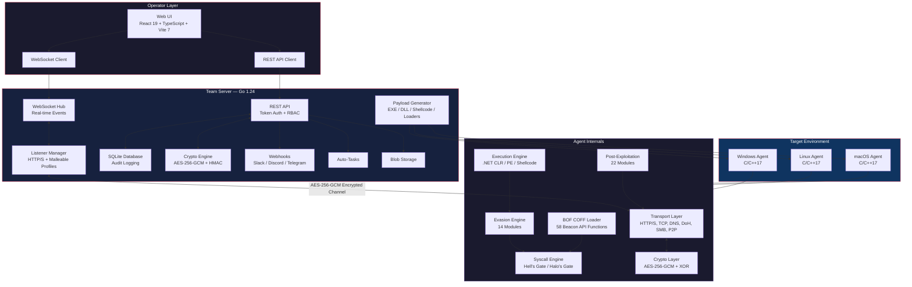

```
 ____  _____ _     ____ ____
|  _ \|_   _| |   / ___|___ \
| |_) | | | | |  | |     __) |
|  _ <  | | | |__| |___ / __/
|_| \_\ |_| |_____\____|_____|

Red Team Leaders C2 Framework
         v0.7.0
```

<p align="center">
  <strong>Advanced Command and Control Framework for Authorized Red Team Operations</strong>
</p>

<p align="center">
  
  
  
  
  
  
</p>

---

**Author:** Joas Antonio dos Santos ([CyberSecurityUP](https://github.com/CyberSecurityUP))
**License:** Proprietary - Red Team Leaders
**Intended Use:** Authorized red team operations and security research only

---

## Table of Contents

- [Overview](#overview)
- [Architecture](#architecture)
- [Features](#features)
  - [Agent Capabilities](#agent-capabilities)
  - [Transport Channels](#transport-channels)
  - [Evasion Modules](#evasion-modules)
  - [Cryptography](#cryptography)
  - [Syscall Engine](#syscall-engine)
  - [BOF Arsenal](#bof-arsenal)
  - [Malleable C2 Profiles](#malleable-c2-profiles)
  - [Persistence Mechanisms](#persistence-mechanisms)
  - [Privilege Escalation](#privilege-escalation)
  - [Team Server](#team-server)
  - [Web Interface](#web-interface)
- [Project Structure](#project-structure)
- [Prerequisites](#prerequisites)
- [Build Instructions](#build-instructions)
- [Quick Start](#quick-start)
- [Communication Protocol](#communication-protocol)
- [Agent Build Configuration](#agent-build-configuration)
- [Dependencies](#dependencies)
- [Disclaimer](#disclaimer)

---

## Overview

RTLC2 (Red Team Leaders C2) is a full-featured command and control framework designed for professional red team engagements. It provides a modular C/C++17 agent with extensive evasion capabilities, a Go-based team server with real-time collaboration features, and a modern React web interface for operator management.

The framework supports 40 task types, 6 transport channels, 14 evasion modules, 67 Beacon Object Files, and 23 malleable C2 profiles emulating known threat actors and legitimate services.

---

## Architecture



| Component | Technology | Description |
|-----------|-----------|-------------|
| **Agent** | C/C++17, CMake | Cross-platform implant (Windows primary, Linux, macOS) with modular evasion, transport, and post-exploitation capabilities |
| **Team Server** | Go 1.24, SQLite | Central coordination server with REST API, WebSocket events, RBAC, payload generation, and campaign management |
| **Web UI** | React 19, TypeScript, Vite 7, Zustand 5 | Modern operator interface with real-time dashboards, interactive consoles, and collaboration tools |

---

## Features

### Agent Capabilities

The agent supports **40 task types** covering the full spectrum of post-exploitation operations:

| Category | Commands |
|----------|----------|
| **System** | `shell`, `ps`, `whoami`, `ipconfig`, `env`, `pwd`, `cd`, `ls` |
| **File Operations** | `upload`, `download`, `file-copy`, `file-move`, `file-delete`, `mkdir` |
| **Execution** | `powershell`, `assembly`, `bof`, `inject`, `module`, `lolbas`, `runas` |
| **Collection** | `screenshot`, `keylog`, `clipboard`, `hashdump`, `reg-query` |
| **Network** | `portscan`, `socks`, `pivot`, `rportfwd` |
| **Persistence** | `persist`, `unpersist`, `service`, `regwrite` |
| **Management** | `sleep`, `jobs`, `selfdestruct`, `exit`, `privesc`, `token` |

### Transport Channels

Six transport channels provide flexible communication options:

| Transport | Description | Platform |
|-----------|-------------|----------|
| **HTTP/HTTPS** | WinHTTP on Windows, libcurl on POSIX. Supports malleable profiles and domain fronting. | All |
| **TCP** | Raw TCP with optional TLS wrapping for low-level communication. | All |
| **DNS Tunneling** | Base32-encoded payloads tunneled through DNS queries. | All |
| **DNS over HTTPS (DoH)** | DNS tunneling routed through HTTPS resolvers to bypass network inspection. | All |
| **SMB Named Pipes** | Agent-to-agent communication via named pipes for lateral movement. | Windows |
| **P2P** | Direct agent-to-agent mesh networking via named pipes or unix sockets. | All |

### Evasion Modules

Fourteen evasion modules provide defense against endpoint detection:

| Module | Techniques |
|--------|-----------|
| **AMSI Bypass** | PatchAmsiScanBuffer, PatchAmsiOpenSession, PatchAmsiInitialize, COM Provider Hijack |
| **ETW Patching** | PatchEtwEventWrite, NtTraceEvent, NtTraceControl, ETW-TI bypass |
| **NTDLL Unhooking** | From KnownDlls section, from disk, from suspended process |
| **Stack Frame Spoofing** | Forge call stack to evade stack-walking detections |
| **PPID Spoofing** | Create processes under arbitrary parent PIDs |
| **Heap Encryption** | Encrypt heap during sleep using Ekko and Foliage timer callbacks |
| **Module Stomping** | Load payloads into memory of legitimate signed DLLs |
| **Anti-Sandbox** | Hardware fingerprinting, timing checks, debugger detection, VM detection |
| **Hardware Breakpoint Hooks** | Inline hooking via debug registers without patching code |
| **Threadless Injection** | IAT hijack-based injection without creating remote threads |
| **Argument Spoofing** | Replace process command-line arguments post-creation |
| **Sleep Obfuscation** | Encrypted sleep with configurable jitter to evade memory scanners |
| **Process Injection** | CreateRemoteThread, APC queue, process hollowing, early bird injection |
| **Environment Keying** | Execution gated by domain, username, or file presence |

### Cryptography

| Feature | Implementation |
|---------|---------------|
| **Symmetric Encryption** | AES-256-GCM with session key exchange |
| **Obfuscation Layer** | XOR double encryption on top of AES |
| **API Hashing** | DJB2 hash-based API resolution |
| **String Obfuscation** | Compile-time XOR with seed rotation |
| **Shellcode Encoding** | Multi-stage encoding for payload delivery |

### Syscall Engine

| Feature | Description |
|---------|-------------|
| **Hell's Gate** | Runtime SSN resolution from in-memory NTDLL |
| **Halo's Gate** | Fallback SSN resolution when syscall stubs are hooked |
| **Direct Syscalls** | Bypass user-mode hooks via direct `syscall` instruction |
| **Indirect Syscalls** | Execute syscalls through legitimate ntdll code regions |
| **Multi-Architecture** | Per-architecture gate implementations for x86, x64, and ARM64 |

### BOF Arsenal

**67 Beacon Object Files** organized across 6 categories, executable through the integrated COFF loader with 58 Beacon API functions:

<details>
<summary><strong>Reconnaissance (24 BOFs)</strong></summary>

`whoami`, `portscan`, `netstat`, `adcs_enum`, `arp`, `cacls`, `dns_cache`, `domain_trusts`, `driversigs`, `env`, `ipconfig_full`, `ldap_query`, `listdns`, `locale`, `nslookup`, `resources`, `schtasks_query`, `tasklist`, `uptime`, and more.
</details>

<details>
<summary><strong>Credential Access (9 BOFs)</strong></summary>

`hashdump`, `nanodump`, `kerberoast`, `dcsync`, `zerologon`, WiFi credential extraction, vault dump, `shadow_dump`.
</details>

<details>
<summary><strong>Lateral Movement (8 BOFs)</strong></summary>

`psexec`, `schtask_create`, `sc_create`, `sc_start`, `sc_stop`, `sc_delete`, `reg_save`, `winrm`.
</details>

<details>
<summary><strong>Evasion (10 BOFs)</strong></summary>

`syscalls_inject`, `callback_injection`, `module_stomp`, `ppid_spoof`, `block_dlls`, `unhook`, `etw_disable`, and more.
</details>

<details>
<summary><strong>Persistence (10 BOFs)</strong></summary>

`registry_persist`, `startup_folder`, `wmi_persist`, `dll_hijack`, `service_persist`, `schtask_persist`, `com_hijack`, `scheduled_task`, `typelib_hijacking`.
</details>

<details>
<summary><strong>.NET / Execution (8 BOFs)</strong></summary>

`inline_execute_assembly`, `sharphound`, `seatbelt`, `rubeus`, `certify`, `sharpview`, `watson`, `asrenum`.
</details>

### Malleable C2 Profiles

**23 malleable profiles** for traffic shaping and network evasion:

| Category | Profiles |
|----------|----------|
| **Legitimate Services** | Amazon, GitHub API, StackOverflow, Wikipedia, Dropbox, Zoom, Windows Update, Office 365 |
| **APT Emulation** | APT29, APT28, APT32, APT41, Turla, Lazarus, FIN7, HAFNIUM |
| **Crimeware Emulation** | Cobalt Strike, TrickBot, Emotet, QakBot, IcedID, BumbleBee, Sliver |

### Persistence Mechanisms

| Platform | Techniques |
|----------|-----------|
| **Windows (8)** | RegistryRunKey, ScheduledTask, WMISubscription, ServiceInstall, StartupFolder, COMHijack, DLLSearchOrder, RegistryLogonScript |
| **Linux (3)** | Crontab, SystemdService, BashRC |
| **macOS (2)** | LaunchAgent, LaunchDaemon |

### Privilege Escalation

| Technique | Description |
|-----------|-------------|
| **UAC Bypass - Fodhelper** | Registry-based UAC bypass via `fodhelper.exe` auto-elevate |
| **UAC Bypass - Eventvwr** | Registry-based UAC bypass via `eventvwr.exe` auto-elevate |
| **Token Abuse** | Token impersonation and privilege manipulation |
| **Auto-Elevate Exploitation** | Abuse of auto-elevate binaries for privilege escalation |

### Team Server

- **REST API** with token-based authentication
- **WebSocket** real-time events (`agent_new`, `agent_dead`, `checkin`, `task_complete`, `chat`, and more)
- **RBAC** with three roles: `admin`, `operator`, `viewer`
- **SQLite** database with full audit logging
- **Payload Generation**: EXE, DLL, shellcode, and loaders
- **Download Cradles**: 12 formats (PowerShell, certutil, bitsadmin, curl, wget, etc.)
- **Hosted Files**: Serve files through listeners
- **Webhooks**: Slack, Discord, Telegram, and generic HTTP notifications
- **Auto-Tasks**: Automatic task assignment on agent registration
- **Campaign Management**: Organize operations by campaign
- **Blob Storage**: Store and retrieve arbitrary binary data
- **Operator Chat**: Real-time team communication via WebSocket

### Web Interface

- **Dashboard** with live metrics, charts, and operational overview
- **Agent Table** with real-time status indicators and filtering
- **Interactive Task Console** with 42 commands and tab autocomplete
- **Listener Management** with malleable profile selection
- **Payload Generator** with per-module evasion toggles
- **BOF Panel** with category filtering, OPSEC risk indicators, and multi-agent execution
- **.NET Assembly Panel** for inline assembly execution
- **Screenshot Gallery** viewer with thumbnails and zoom
- **Keylogger Timeline** viewer with search and export
- **SOCKS Proxy Manager** for tunnel management
- **Token Manager** for impersonation tokens
- **Tag Manager** for agent organization
- **Webhook and Auto-Task** management panels
- **Credential Panel** for harvested credential management
- **Chat Panel** for operator communication
- **Toast Notifications** via WebSocket for real-time alerts
- **Dark theme** with red accent styling

---

## Project Structure

```
RTLC2/
├── Makefile                            # Build system
├── configs/
│   └── teamserver.yaml                 # Server configuration
├── teamserver/                         # Go Team Server
│   ├── cmd/teamserver/main.go          # Entry point
│   ├── internal/
│   │   ├── server/                     # REST API, WebSocket, payloads, BOF, RBAC
│   │   ├── agent/                      # Agent session management
│   │   ├── listener/                   # HTTP/S listeners + malleable profiles
│   │   ├── database/                   # SQLite data layer
│   │   ├── crypto/                     # AES-256-GCM, XOR, HMAC
│   │   └── config/                     # YAML config + validation
│   └── bofs/                           # 67 BOF metadata JSON files
├── agent/                              # C/C++17 Agent
│   ├── CMakeLists.txt                  # CMake build with configurable options
│   ├── include/                        # 12 header files
│   ├── loader/                         # Shellcode loaders (Win/POSIX)
│   └── src/
│       ├── core/                       # Agent core, task handlers, job manager
│       ├── transport/                  # HTTP, TCP, DNS, DoH, SMB, P2P
│       ├── crypto/                     # AES, XOR, obfuscation, shellcode encoder
│       ├── evasion/                    # 14 evasion modules
│       ├── execution/                  # .NET CLR, PE loader, shellcode, PowerShell, LOLBAS
│       ├── bof/                        # BOF COFF loader (58 Beacon API functions)
│       ├── syscalls/                   # Hell's Gate / Halo's Gate + gates (x86/x64/ARM64)
│       └── modules/                    # 22 post-exploitation modules
├── web/                                # React/TypeScript Web UI
│   └── src/
│       ├── components/                 # UI components
│       ├── pages/                      # Login, Main
│       ├── store/                      # Zustand state management
│       ├── api/                        # REST API client
│       ├── types/                      # TypeScript type definitions
│       └── styles/                     # CSS theme (dark + red)
├── profiles/                           # 23 malleable C2 profiles
├── plugins/                            # Plugin metadata
├── scripts/                            # Build and deployment scripts
│   ├── generate_agent.sh               # Agent payload generation
│   ├── generate_powershell.sh          # PowerShell cradle generation
│   └── setup_kali.sh                   # Kali Linux deployment setup
└── docs/                               # Documentation
```

---

## Prerequisites

| Dependency | Minimum Version | Purpose |
|-----------|----------------|---------|
| **Go** | 1.24+ | Team server compilation |
| **CMake** | 3.16+ | Agent build system |
| **Node.js** | 18+ | Web UI build tooling |
| **OpenSSL** | 1.1+ | TLS and cryptographic operations |
| **libcurl** | 7.x | POSIX HTTP transport |
| **MinGW-w64** | -- | Windows agent cross-compilation (optional) |

---

## Build Instructions

```bash
# Install Go module dependencies
make setup

# Build everything (team server + web UI)
make all

# Build the native agent for the current platform
make agent

# Cross-compile the agent for Windows
make agent-windows

# Cross-compile the team server for Linux
make teamserver-linux
```

Individual build targets are available for granular control. Run `make help` for the full list of available targets.

---

## Quick Start

### 1. Start the Team Server

```bash
./build/rtlc2-teamserver -config configs/teamserver.yaml
```

### 2. Access the Web Interface

Navigate to `http://<server-ip>:54321` in your browser.

### 3. Authenticate

Log in using the operator credentials defined in `configs/teamserver.yaml`.

### 4. Create a Listener

Open the **Listeners** tab and configure an HTTP/HTTPS listener. Optionally select a malleable C2 profile to shape network traffic.

### 5. Generate a Payload

Use the **Payload Generator** in the sidebar to build an agent binary. Configure transport type, evasion toggles, and OPSEC settings as needed for the target environment.

### 6. Deploy

Transfer the generated payload to the target system and execute it. The agent will check in to the team server automatically based on the configured sleep interval and jitter.

### Kali Linux Deployment

```bash
sudo bash scripts/setup_kali.sh
```

This script installs all dependencies, builds the team server and web UI, and configures the environment for operation.

---

## Communication Protocol

All communication between agents and the team server is encrypted with AES-256-GCM. An additional XOR layer provides defense-in-depth obfuscation.

### Registration Flow

```
Agent  ──[ AES-GCM(master_key, registration_json) ]──>  Server
Agent  <──[ AES-GCM(master_key, { agent_id, session_key }) ]──  Server
```

### Check-in Flow

```
Agent  ──[ agent_id (8 bytes) || AES-GCM(session_key, checkin_json) ]──>  Server
Agent  <──[ AES-GCM(session_key, { tasks: [...] }) ]──  Server
```

The 8-byte agent ID prefix allows the server to look up the correct session key before decryption. Session keys are unique per agent and rotated on re-registration.

---

## Agent Build Configuration

The agent is configured at compile time via CMake definitions. All options are passed with `-D` flags during the CMake configure step.

### Core Settings

| Option | Description | Default |
|--------|-------------|---------|
| `RTLC2_C2_HOST` | Team server hostname or IP | -- |
| `RTLC2_C2_PORT` | Team server port | -- |
| `RTLC2_SLEEP_INTERVAL` | Check-in interval in seconds | -- |
| `RTLC2_JITTER` | Jitter percentage (0-100) | -- |
| `RTLC2_USE_TLS` | Enable TLS for HTTP transport | -- |
| `RTLC2_AES_KEY` | Pre-shared AES-256 master key | -- |
| `RTLC2_USER_AGENT` | HTTP User-Agent string | -- |
| `RTLC2_DEBUG` | Enable debug output | -- |

### OPSEC Settings

| Option | Values | Description |
|--------|--------|-------------|
| `RTLC2_SLEEP_MASK` | `0` / `1` / `2` | Sleep obfuscation mode (off / Ekko / Foliage) |
| `RTLC2_STACK_SPOOF` | `ON` / `OFF` | Stack frame spoofing |
| `RTLC2_ETW_PATCH` | `ON` / `OFF` | ETW patching |
| `RTLC2_UNHOOK_NTDLL` | `ON` / `OFF` | NTDLL unhooking at startup |
| `RTLC2_SYSCALL_METHOD` | `none` / `direct` / `indirect` / `hells_gate` | Syscall invocation method |
| `RTLC2_AMSI_PATCH` | `ON` / `OFF` | AMSI bypass |
| `RTLC2_HEAP_ENCRYPT` | `ON` / `OFF` | Heap encryption during sleep |
| `RTLC2_ETWTI_PATCH` | `ON` / `OFF` | ETW Threat Intelligence bypass |
| `RTLC2_MODULE_STOMP` | `ON` / `OFF` | Module stomping loader |
| `RTLC2_SPAWN_TO` | Path | Process to use for spawn-and-inject operations |

### Scheduling and Kill Switch

| Option | Description |
|--------|-------------|
| `RTLC2_KILL_DATE` | Agent self-destructs after this date |
| `RTLC2_WORK_START_HOUR` | Only operate after this hour (0-23) |
| `RTLC2_WORK_END_HOUR` | Only operate before this hour (0-23) |
| `RTLC2_WORK_DAYS` | Bitmask of active days |

### Transport Settings

| Option | Description |
|--------|-------------|
| `RTLC2_TRANSPORT_TYPE` | `http` / `tcp` / `dns` / `doh` |
| `RTLC2_DOH_RESOLVER` | DNS-over-HTTPS resolver URL |
| `RTLC2_FRONT_DOMAIN` | Domain fronting host header |

### Environment Keying

| Option | Description |
|--------|-------------|
| `RTLC2_ENV_KEY_DOMAIN` | Only execute if joined to this domain |
| `RTLC2_ENV_KEY_USER` | Only execute under this username |
| `RTLC2_ENV_KEY_FILE` | Only execute if this file exists |

---

## Dependencies

### Team Server (Go)

| Package | Purpose |
|---------|---------|
| `google/uuid` | Agent and session ID generation |
| `gorilla/websocket` | WebSocket real-time communication |
| `mattn/go-sqlite3` | SQLite database driver |
| `miekg/dns` | DNS listener and tunneling |
| `sirupsen/logrus` | Structured logging |
| `golang.org/x/crypto` | Cryptographic primitives |
| `gopkg.in/yaml.v3` | YAML configuration parsing |

### Web UI (Node.js)

| Package | Version | Purpose |
|---------|---------|---------|
| `react` | 19 | UI framework |
| `react-dom` | 19 | DOM rendering |
| `react-router-dom` | 7 | Client-side routing |
| `zustand` | 5 | State management |
| `vite` | 7 | Build tooling and dev server |
| `typescript` | 5.9 | Type-safe development |

---

## Disclaimer

RTLC2 is designed and intended **exclusively for authorized red team operations and security research**. Use of this software against systems without explicit written authorization is illegal and unethical.

The author and contributors assume no liability for misuse of this tool. Users are solely responsible for ensuring all activities conducted with RTLC2 comply with applicable laws, regulations, and organizational policies.

**By using RTLC2, you agree that:**

- You have written authorization from the system owner(s) for all target systems.
- You will use this tool only within the scope of authorized engagements.
- You accept full responsibility for your actions.

---

<p align="center">
  <strong>RTLC2</strong> -- Red Team Leaders C2 Framework v0.7.0<br>
  Developed by Joas Antonio dos Santos (CyberSecurityUP)<br>
  Proprietary - Red Team Leaders. All rights reserved.
</p>
